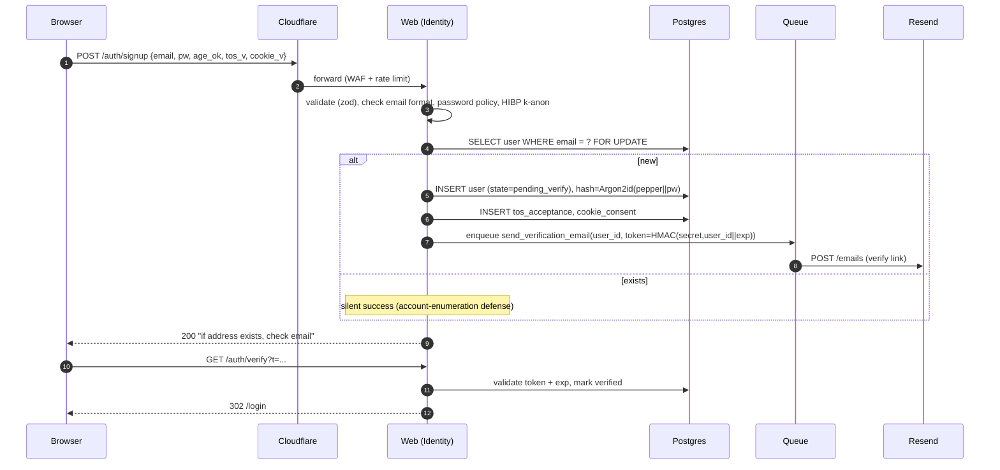
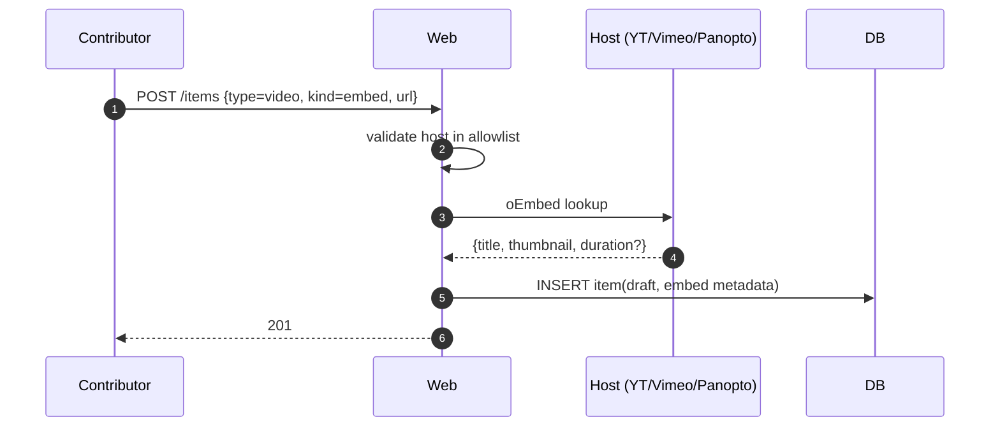
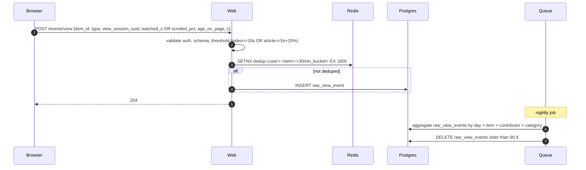
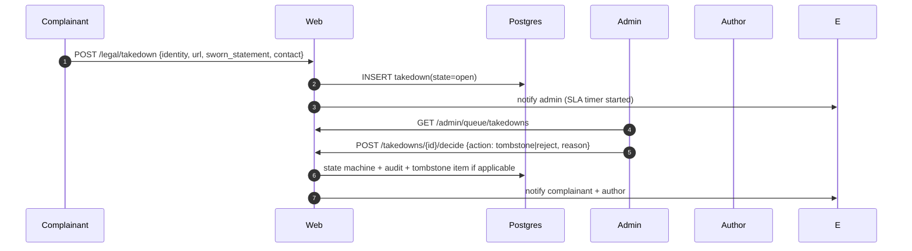
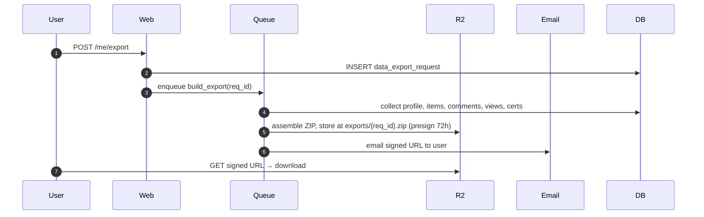
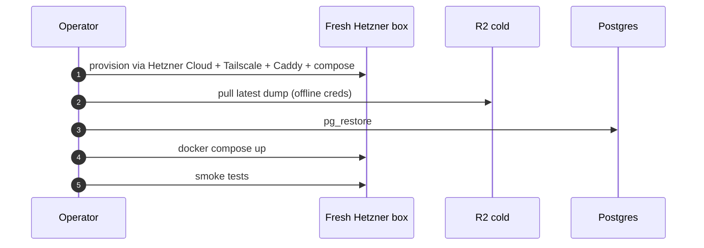
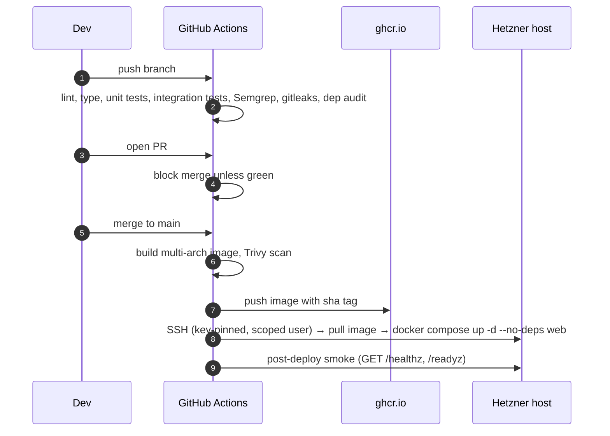

<!-- markdownlint-disable MD013 MD024 MD033 -->
# 02 — Architecture & Dynamic Protocols

| Project | NDSC Lab |
|---|---|
| Document version | 1.0 |
| Date frozen | 2026-05-13 |
| Phase | 2 — Architecture & Data Model Design |
| Inputs | `01_requirements.md` v1.0 |

> Technology-agnostic where possible. Concrete vendors fixed by Phase 1 are referenced where unavoidable (Hetzner, Cloudflare R2/CDN, Resend). Specific framework/library choices land in `04_tech_stack.md`.

---

## 1. Architectural style

**Modular monolith, deployed as a small set of Docker containers behind a CDN.**

Chosen over microservices because:

- Sole-operator project (`CON-007`); one deploy unit, one log stream, one DB.
- Sub-1000 users; microservices' overhead would dominate.
- Tight budget (`CON-001`); microservices multiply infra cost.
- Clear bounded contexts (Auth, Content, Curation, Comments, Analytics, Certification, Admin, Legal) can be enforced *inside* the monolith as packages with explicit interfaces, preserving the option to extract services later if scale changes.

**Trust boundaries:**

```
Internet ───► Cloudflare (TLS/WAF/CDN) ───► Reverse proxy (Caddy) ───► App container(s) ───► PG / Redis / R2 / ClamAV / Resend
                                                                                          \─► Backup target (R2 cold bucket, separate creds)
```

Three trust zones: **public edge** (Cloudflare), **trusted private** (compose network), **secret store** (env-injected at boot; never on disk in containers).

---

## 2. Logical architecture — bounded contexts

| Context | Responsibility | Owns entities |
|---|---|---|
| **Identity & Access** | Signup, login (password + Google OAuth), sessions, password reset, role transitions, age confirmation, ToS acceptance versioning, rate limits, MFA-ready hooks. | User, Session, Credential, OAuthIdentity, RoleTransition, ToSAcceptance, LoginAttempt. |
| **Content** | Items (Video / Article / TeachingMaterial), drafts, review queue, publication state machine, attachments, license, paywall placeholder. | Item, ItemVersion, Attachment, Tag, Category, ItemTag, ItemCategory, ReviewSubmission, ReviewDecision. |
| **Curation** | Contributor pages, profile, Collections, Course subtype, completion criteria, user progress, Workshops. | ContributorProfile, ProfileSection, Collection, CollectionItem, CourseCompletionCriterion, UserCourseProgress, Workshop, WorkshopSpeaker. |
| **Comments** | Item comments, edits, reports, moderation. | Comment, CommentReport. |
| **Analytics** | View events, dedup, aggregation, admin dashboards, retention. | RawViewEvent, DailyItemAggregate, DailyContributorAggregate, DailyCategoryAggregate. |
| **Certification** | Ed25519 key custody, certificate issuance, PDF generation, verification, revocation, VC-extensible signer interface. | SigningKey, Certificate, CertificateRevocation. |
| **Admin & Audit** | Reports queue, audit log, platform settings, per-contributor tunables, banners, email-template management. | AuditLogEntry, AdminQueueItem, PlatformSetting, ContributorTunable, Announcement, EmailTemplate. |
| **Legal & Privacy** | ToS / privacy pages, cookie consent, DMCA takedown queue, right-to-erasure, data export. | LegalDocument, CookieConsent, TakedownRequest, ErasureRequest, DataExportRequest. |
| **Notifications** | Email dispatch via Resend, in-app notifications, templating, retries. | OutboundEmail, EmailEvent, InAppNotification. |

Each context is a top-level package (e.g., `app/identity`, `app/content`). Cross-context calls go through a thin facade per context. Each context owns its tables and migrations; foreign keys cross contexts only via stable User-ID and Item-ID references.

---

## 3. Physical architecture

### 3.1 Components

```
┌──────────────── Cloudflare (free tier) ────────────────┐
│  TLS, HSTS, WAF managed rules, DDoS, CDN cache,        │
│  rate-limit rules, R2 origin for blob streaming         │
└─────┬─────────────────────────────────────────────────┬─┘
      │ HTTPS                                          │
      ▼                                                ▼
┌──────────────────────────── Hetzner VPS (EU, Falkenstein) ────────────────────────────┐
│                                                                                       │
│  Caddy (TLS termination behind CF, automatic origin cert)                             │
│   │                                                                                   │
│   ├──► App container (web)         ◄─── Postgres 16 (Docker, encrypted volume)        │
│   │       FastAPI / Litestar       ◄─── Redis 7 (sessions, rate-limit, queue)         │
│   │       Workers (rq/dramatiq)    ◄─── ClamAV (clamd Docker sidecar)                 │
│   │                                                                                   │
│   ├──► Prometheus (scrape app /metrics)                                               │
│   ├──► Grafana (dashboards)                                                           │
│   ├──► GlitchTip (self-hosted Sentry-compatible)                                      │
│   └──► Loki (optional, structured log aggregation)                                    │
│                                                                                       │
│  Resumable upload endpoint (tus) ──► R2 (multipart) (hot bucket)                      │
│  Daily PG dump (cron) ─────────────► R2 (cold bucket, separate IAM)                   │
└───────────────────────────────────────────────────────────────────────────────────────┘
                  │                              │
                  ▼                              ▼
            Cloudflare R2 hot           Cloudflare R2 cold (backups, separate creds)
              (CF CDN-fronted)
```

### 3.2 Why this shape

| NFR | How met |
|---|---|
| NFR-PERF-001/2 (page latency) | CDN cache for static + image; HTTP cache headers on Item pages (private when authenticated, public when not). |
| NFR-PERF-003 (video first-frame) | Direct streaming from R2 via CDN with HTTP range; no transcoding (`FR-VIDEO-002`). |
| NFR-PERF-004 (search) | Postgres FTS with GIN index. |
| NFR-AVAIL-001 (99% uptime) | Single VPS acceptable for 99%; Hetzner SLA + Cloudflare absorbing edge. |
| NFR-AVAIL-003/4 (RPO 24h / RTO 4h) | Daily encrypted `pg_dump` to cold R2; blobs already durable on R2. Restore runbook validates RTO. |
| NFR-SEC-007 (virus scan) | ClamAV Docker sidecar; uploads quarantined until clean. |
| NFR-SEC-009 (DDoS) | Cloudflare in front; origin reachable only via CF IP allowlist. |
| NFR-SEC-008 (signed URLs) | R2 access strictly via S3-API presign with 1 h TTL. |
| NFR-OBS-* | Prometheus + Grafana + GlitchTip co-located. |
| NFR-MAINT-001/2 (docker, portable) | Entire system in `compose.yml`; one `.env` swap → run on any docker host. |
| CON-006 (EU residency) | Hetzner Falkenstein + R2 EU jurisdictional. |

### 3.3 Single VPS sizing (initial)

- **Hetzner CCX13 / CX22** (2–4 vCPU, 8 GB RAM, ~50 GB NVMe). ~7–15 EUR/mo.
- Containers: web (1), worker (1), pg (1), redis (1), clamav (1), prom (1), grafana (1), glitchtip (1), caddy (1). ~9 containers, well within 8 GB RAM at this scale.
- R2 hot blobs at ~200 GB ⇒ ~3 EUR. Bandwidth from R2 → CDN is free.
- Resend free (3k mails/mo) + Cloudflare free + UptimeRobot free.
- **Steady state ~18–25 EUR/mo**, comfortable under nominal CON-001 target.

---

## 4. Cross-cutting design

### 4.1 Authentication & sessions

- **Sessions are server-side**, opaque token in secure HTTPOnly SameSite=Lax cookie; record kept in Redis with TTL 30 d sliding.
- **CSRF**: double-submit cookie; non-idempotent endpoints require `X-CSRF` header matching cookie.
- **Argon2id**: m=64 MiB, t=3, p=1; per-user salt; **server pepper** kept in env (`AUTH_PASSWORD_PEPPER`) and prepended to password before hashing.
- **MFA-ready**: `User.mfa_secret`, `User.mfa_enabled_at` columns exist; login state machine inserts a `mfa_challenge` transition only when `mfa_enabled_at` is non-null.
- **OAuth**: standard OIDC Authorization Code with PKCE; only Google v1.

### 4.2 Authorization (policy module)

Single policy decision point in `app/identity/policy.py`:

```
authorize(actor: User|None, action: str, resource: <typed>) -> Decision
```

Every mutating handler MUST call this. Pattern: explicit-allow; default deny.

Rules expressed as table-driven Python (or Casbin model file). Sample rules:

| Action | Allowed when |
|---|---|
| `item.publish` | actor.role == Admin, OR (actor.role == Contributor AND resource.author_id == actor.id AND resource.state == pending_review). |
| `item.delete` | actor.role == Admin OR resource.author_id == actor.id. |
| `comment.delete` | actor.role == Admin OR resource.author_id == actor.id. |
| `analytics.read` | actor.role == Admin. |
| `cert.issue` | actor.role == Admin. |
| `contributor.role.grant` | actor.role == Admin. |

### 4.3 Auditing

Every administrative or security-sensitive action writes a row to `audit_log`:

```
audit_log(id, ts, actor_user_id, actor_ip, actor_user_agent, action, target_type, target_id, payload_json, prev_hmac, hmac)
```

`hmac = HMAC_SHA256(server_audit_key, prev_hmac || canonical_row)` — append-only chain for tamper evidence (`NFR-SEC-014`).

### 4.4 Configuration & secrets

- All config via env. `.env.example` committed; real `.env` excluded.
- Secrets: app DB password, Redis password, Resend API key, Google OAuth client secret, R2 access keys (hot + cold separate), server pepper, audit-log HMAC key, Ed25519 signing key (PEM).
- **Key rotation runbook** for: pepper (re-hash on next successful login, not bulk), audit HMAC (chain epoch boundary), Ed25519 (multi-key verification window per `FR-CERT-001`).

### 4.5 Idempotency

- All mutating client-driven actions (esp. uploads, payment-ready code paths) accept an `Idempotency-Key` header; cached response for 24 h.
- View events: client emits a UUID per view session; server dedup at aggregation.

### 4.6 Caching layers

| Cache | TTL | Invalidation |
|---|---|---|
| CDN public Item HTML | 5 min, `s-maxage` | Purge by URL on publish/unpublish/edit. |
| Redis per-user feed cache | 60 s | Lazy expiry. |
| Argon2 verification result | none (intentional) | — |
| OG image | 7 d | Purge on edit. |

### 4.7 Background work

- Job queue on Redis (RQ or Dramatiq).
- Job types: send email, generate certificate PDF, scan upload with ClamAV, aggregate raw events, build data export ZIP, lifecycle-delete tombstoned blobs.

### 4.8 Health, observability, alerts

- `/healthz` (liveness): web returns 200 if process up.
- `/readyz`: 200 only if PG, Redis, R2 reachable.
- `/metrics`: Prometheus exposition.
- Alerts to admin email (Resend) + optional Telegram bot.

### 4.9 Trust boundaries (STRIDE in `06_verification.md`)

1. Public internet ↔ Cloudflare.
2. Cloudflare ↔ Origin VPS (CF IP allowlist on origin).
3. App ↔ R2 (presigned URLs only, scoped IAM).
4. App ↔ Resend (API key, sender-domain DKIM/SPF/DMARC).
5. App ↔ Google OAuth.
6. App ↔ Browser (via cookies + CSRF).
7. Admin process ↔ Backup bucket (separate IAM, write-only from prod).

---

## 5. Dynamic protocols (sequence diagrams)

Notation: Mermaid sequence diagrams. Each protocol references requirement IDs it implements.

### 5.1 P-SIGNUP — Email/password signup + verification

Implements `FR-AUTH-001`, `FR-AUTH-008`, `FR-LEG-001`, `FR-LEG-003`, `NFR-SEC-001`, `NFR-SEC-006`, `NFR-SEC-010`.



### 5.2 P-OAUTH — Google OAuth login

Implements `FR-AUTH-002`, `FR-AUTH-003`.

```mermaid
sequenceDiagram
    autonumber
    participant B as Browser
    participant W as Web
    participant G as Google OIDC

    B->>W: GET /auth/google/start
    W->>W: gen state, code_verifier; store state in signed cookie
    W-->>B: 302 to Google authorize?...code_challenge=S256
    B->>G: consent
    G-->>B: 302 /auth/google/cb?code=...&state=...
    B->>W: GET /auth/google/cb
    W->>W: verify state, signed cookie
    W->>G: POST /token (code, verifier)
    G-->>W: id_token + access_token
    W->>W: verify id_token sig, iss, aud, exp, nonce
    W->>DB: upsert OAuthIdentity(google,sub) → user
    alt new user
        W->>DB: INSERT user (state=verified, role=user)
    end
    W->>DB: INSERT session(redis), set cookie
    W-->>B: 302 / (post-login)
```

### 5.3 P-LOGIN — Password login (with lockout + CSRF bootstrap)

Implements `FR-AUTH-003`, `FR-AUTH-007`, `NFR-SEC-004`, `NFR-SEC-010`.

```mermaid
sequenceDiagram
    autonumber
    participant B as Browser
    participant W as Web
    participant R as Redis (RL)
    participant DB as Postgres

    B->>W: POST /auth/login {email, pw}  (X-CSRF header)
    W->>R: INCR rl:ip:<ip>:15m ; INCR rl:acct:<email>:15m
    alt rate limited
        W-->>B: 429
    end
    W->>DB: SELECT user WHERE email = ?
    alt not found OR not verified
        W-->>B: 401 generic
    else
        W->>W: argon2.verify(stored_hash, pepper||pw)
        alt fail
            W->>DB: INSERT login_attempt(fail)
            W-->>B: 401 generic
        else success
            W->>DB: INSERT login_attempt(ok); reset lockouts
            W->>R: SET session:<sid> {user_id, csrf, ...} TTL 30d
            W-->>B: 302 / + Set-Cookie session, csrf
        end
    end
```

### 5.4 P-CONTRIB-APPLY — Contributor application + approval

Implements `FR-ROLE-002`, `FR-ROLE-003`.

```mermaid
sequenceDiagram
    autonumber
    participant U as User
    participant W as Web
    participant DB as Postgres
    participant A as Admin
    participant E as Email

    U->>W: POST /me/contributor-application {motivation, links}
    W->>DB: INSERT contributor_application(state=pending)
    W->>E: notify admins (digest, hourly)
    A->>W: GET /admin/queue/applications
    A->>W: POST /admin/applications/{id}/decide {approve|reject, comment}
    W->>DB: UPDATE application; if approve: BEGIN; UPDATE user.role=contributor; INSERT role_transition; COMMIT
    W->>E: notify applicant
    W-->>A: 200
```

### 5.5 P-UPLOAD — Hosted video upload (resumable + virus scan + publish)

Implements `FR-VIDEO-001`, `FR-VIDEO-002`, `FR-CONTENT-001..005`, `NFR-SEC-007`, `NFR-SEC-008`.

```mermaid
sequenceDiagram
    autonumber
    participant C as Contributor (browser)
    participant W as Web
    participant R2 as R2 (hot)
    participant Q as Queue
    participant CL as ClamAV
    participant DB as Postgres
    participant A as Admin

    C->>W: POST /uploads {filename,size,mime}  (Idempotency-Key)
    W->>W: authorize (contributor, quota, mime/size policy)
    W->>R2: create multipart upload → upload_id
    W-->>C: 201 {upload_id, part_urls, complete_url, item_draft_id}
    loop parts (resumable, tus protocol)
        C->>R2: PUT part N (signed)
    end
    C->>W: POST /uploads/{id}/complete
    W->>R2: CompleteMultipart
    W->>DB: INSERT attachment(state=scanning, item=draft)
    W->>Q: enqueue scan_upload(attachment_id)
    Q->>CL: scan stream from R2
    alt clean
        Q->>DB: UPDATE attachment.state=clean
    else infected
        Q->>DB: UPDATE attachment.state=quarantined
        Q->>R2: schedule delete
        Q->>E: notify admin + author
    end
    C->>W: POST /items/{draft}/submit
    W->>DB: item.state=pending_review (requires attachment.state in {clean,n/a})
    A->>W: POST /items/{id}/approve
    W->>DB: item.state=published; emit IndexItem event
    W->>CDN: purge URLs
```

### 5.6 P-EMBED — Embedded video item

Implements `FR-VIDEO-003`, `FR-VIDEO-004`.



### 5.7 P-COMMENT-MOD — Comment lifecycle + moderation

Implements `FR-COM-001..004`, `NFR-SEC-010`.

```mermaid
sequenceDiagram
    autonumber
    participant U as User
    participant W as Web
    participant DB as Postgres
    participant A as Admin

    U->>W: POST /items/{id}/comments {body}
    W->>W: rate-limit 5/min; sanitize markdown
    W->>DB: INSERT comment(state=visible)
    U->>W: PATCH /comments/{id} (within 15 min)
    W->>DB: UPDATE if author && age < 15 min
    U->>W: POST /comments/{id}/report
    W->>DB: INSERT comment_report
    A->>W: GET /admin/queue/reports
    A->>W: POST /comments/{id}/moderate {delete|ignore, reason}
    W->>DB: soft delete + audit log
```

### 5.8 P-VIEW — View tracking + dedup + aggregation

Implements `FR-VIEW-001..006`, `NFR-PRIV-007`.



### 5.9 P-COURSE-PROGRESS — Per-user progress + completion suggestion

Implements `FR-COL-002..004`, `FR-CERT-002`.

```mermaid
sequenceDiagram
    autonumber
    participant B as Browser
    participant W as Web
    participant DB as Postgres
    participant Q as Queue

    Note over B,W: each view event already arrives via P-VIEW
    B->>W: POST /events/view ... (item belongs to a Course)
    W->>Q: enqueue evaluate_progress(user_id, item_id)
    Q->>DB: find courses containing item with completion criteria
    Q->>DB: re-evaluate user_course_progress
    alt all required items satisfied
        Q->>DB: mark course completed for user; INSERT cert_suggestion(admin_queue)
    end
```

### 5.10 P-CERT — Certificate issuance + verification

Implements `FR-CERT-001..006`, `NFR-SEC-014`.

```mermaid
sequenceDiagram
    autonumber
    participant A as Admin
    participant W as Web
    participant DB as Postgres
    participant Q as Queue
    participant KS as KeyStore (env)
    participant U as Recipient
    participant V as Verifier (browser)

    A->>W: POST /admin/certificates {user_id, course_id}
    W->>DB: authorize; create certificate(state=issued, id=ULID)
    W->>Q: enqueue render_certificate(cert_id)
    Q->>KS: load Ed25519 private key
    Q->>Q: render PDF (user name, course, date, cert_id, QR(/verify/{id}))
    Q->>Q: sign(PDF bytes) → sig; embed sig + key_id in PDF /CustomMetadata
    Q->>DB: store sig, pdf_bytes (R2), public verification record
    Q->>E: email user "your certificate is ready"
    U->>W: GET /me/certificates → download PDF
    V->>W: GET /verify/{cert_id}
    W-->>V: HTML (issued / revoked, user, course, date)
    V->>W: POST /verify {pdf upload}
    W->>W: load all public keys (current + previous, per FR-CERT-001 rotation window)
    W->>W: extract sig + key_id; verify
    W-->>V: ok | invalid
```

### 5.11 P-MOD-MERGE — Admin tag merge

Implements `FR-ADMIN-010`.

```mermaid
sequenceDiagram
    autonumber
    participant A as Admin
    participant W as Web
    participant DB as Postgres

    A->>W: POST /admin/tags/merge {from, into}
    W->>DB: BEGIN; UPDATE item_tag SET tag=into WHERE tag=from; DELETE tag from; audit; COMMIT
    W-->>A: 200
```

### 5.12 P-TAKEDOWN — DMCA-style takedown

Implements `FR-LEG-002`.



### 5.13 P-ERASE — Right-to-erasure

Implements `FR-LEG-004`, `NFR-PRIV-006`.

```mermaid
sequenceDiagram
    autonumber
    participant U as User
    participant W as Web
    participant Q as Queue
    participant DB as Postgres
    participant R2 as R2

    U->>W: POST /me/delete (confirm pw)
    W->>DB: INSERT erasure_request(state=pending, eta=+30d)
    W->>Q: enqueue erase(user_id, after=now+grace 7d)
    Note over U: 7-day grace; user can cancel
    Q->>DB: hard-delete user, content (per choice), tokens, sessions
    Q->>DB: pseudonymize audit_log.actor where target_type ≠ admin
    Q->>R2: delete user blobs (DELETE all keys under user/{id}/)
    Q->>E: email confirmation
```

### 5.14 P-EXPORT — GDPR data export

Implements `FR-LEG-005`.



### 5.15 P-BACKUP — Backup + restore drill

Implements `NFR-AVAIL-003..005`, `NFR-MAINT-007`.

```mermaid
sequenceDiagram
    autonumber
    participant Cron as Host cron
    participant PG as Postgres
    participant GPG as age (encryption)
    participant R2 as R2 cold bucket

    Cron->>PG: pg_dump --format=c
    PG-->>Cron: dump file
    Cron->>GPG: age encrypt (recipient = backup pubkey)
    Cron->>R2: PUT with cold-bucket creds (write-only IAM)
    Note over R2: lifecycle: keep 30 d
    Note over R2: separate creds from hot bucket; prod app cannot read cold
```

Restore (runbook):



### 5.16 P-DEPLOY — CI/CD pipeline

Implements `NFR-MAINT-005`, `NFR-SEC-011`, `NFR-SEC-012`.



---

## 6. Requirement → architecture traceability (forward)

Full reverse-traceability lives in `06_verification.md`. Forward sample (every FR group):

| FR group | Architectural location |
|---|---|
| FR-AUTH-* | Identity context, P-SIGNUP / P-LOGIN / P-OAUTH; Redis session store; Argon2 + pepper. |
| FR-ROLE-* | Identity policy module; admin queue context. |
| FR-PROFILE-* | Curation context. |
| FR-CONTENT-* | Content context + state machine + review queue. |
| FR-VIDEO-* | Content + Curation; R2 hot; CDN; tus uploader; allowlist. |
| FR-ART-* | Content; Markdown pipeline; KaTeX + Shiki at render. |
| FR-TM-* | Content; R2; signed URLs. |
| FR-COL-* | Curation; UserCourseProgress. |
| FR-CERT-* | Certification; KeyStore; Verifier. |
| FR-COM-* | Comments. |
| FR-VIEW-* | Analytics; Redis dedup; aggregation worker. |
| FR-SEARCH-* | Content; Postgres FTS index. |
| FR-WS-* | Curation; Workshop entity. |
| FR-ADMIN-* | Admin & Audit; queues. |
| FR-LEG-* | Legal & Privacy; takedown; erasure; export. |

---

## 7. Content publication state machine

```
                       contributor.submit
   ┌────────┐  edit  ┌─────────┐  ─────────────────►  ┌────────────────┐
   │ draft  │ ◄────► │ draft   │                       │ pending_review │
   └────────┘        └─────────┘                       └──────┬─────────┘
                                                              │ admin.approve
                                                              ▼
                                              admin.unpublish ┌─────────────┐
                                              ◄───────────── ─│  published  │
                                              author.unpublish└──────┬──────┘
                                                                     │ admin.delete / takedown
                                                                     ▼
                                                              ┌─────────────┐
                                                              │  tombstoned │
                                                              └─────────────┘
```

Invariants:

- Only one author per Item (`FR-PROFILE-` doc, no co-authors v1).
- `published` ⇒ `attachment.state ∈ {n/a, clean}`.
- `tombstoned` blobs deletion-scheduled within 24 h.

---

## 8. NFR mapping (summary)

Detailed mapping in §3.2 + per-protocol "Implements" lines. Compliance design (GDPR + EAA + WCAG) is enforced at the application layer with these gates:

- Signup gate: age check, ToS version, cookie consent — all written transactionally with user record.
- Render gate: a server-side accessibility lint job (axe-core via Playwright) runs in CI on key pages (`NFR-A11Y-001`).
- Privacy gate: erasure job pseudonymizes audit logs (`NFR-PRIV-006`).

---

## 9. Open architectural risks (carried to Phase 5)

1. Single-VPS uptime risk vs 99% target — verify with capacity + chaos analysis (`R-AVAIL-1` in `06_verification.md`).
2. ClamAV definitions stale risk — schedule daily `freshclam`; alert on staleness > 36 h.
3. R2 outage path — degraded mode: serve cached items, queue uploads.
4. Argon2 m=64 MB × peak login concurrency — verify CPU/RAM budget.
5. Postgres FTS quality vs needs — accept; revisit if growth.
6. PDF signature embedding scheme — choose between PAdES (heavy, standard) vs custom-metadata-detached (simple, non-standard). Recommendation: detached signature in `/Custom` dictionary + JSON sidecar; document as "NDSC-cert v1 envelope" in `/.well-known`.
7. Cloudflare IP rotation breaks origin allowlist — automate via Hetzner firewall API.

## 10. Change log

| Date | Change |
|---|---|
| 2026-05-13 | v1.0. |
| 2026-05-13 | v1.1 Phase 6 revision (D-15 audit-chain): the HMAC chain is computed over the **non-PII canonical projection** of each row (action, target_type, target_id, ts, payload_with_pii_pruned). PII columns (`actor_user_id`, `actor_ip`, `actor_ua`) may be pseudonymized post-hoc without breaking the chain. Implementation note: store the canonical projection in a generated text column `audit_log.canon` and HMAC over that. |
| 2026-05-13 | v1.1 (D-09 click-to-play): embedded video lazy-loaded behind a thumbnail+button; provider iframe only loaded after user consent recorded. Added to component "Frontend video player". |
| 2026-05-13 | v1.1 (D-08 bulk content delete on revocation): added background job `purge_contributor_content(user_id, mode={tombstone,delete,reassign})` with checkpointing and idempotency; CDN purge on each batch; R2 deletion in 24 h lifecycle. |
